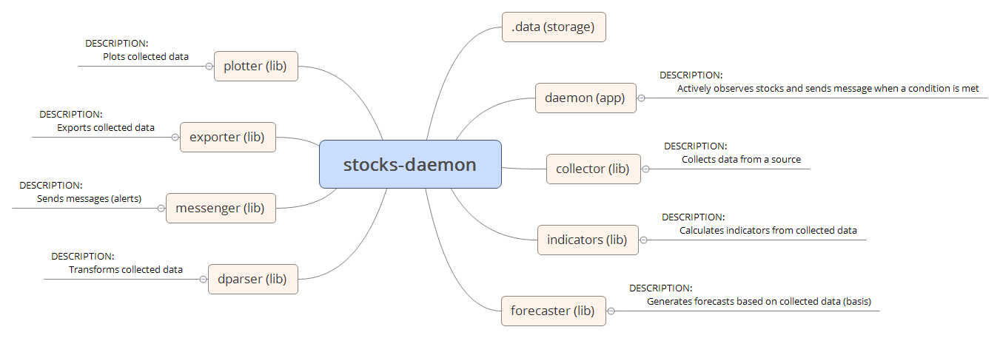
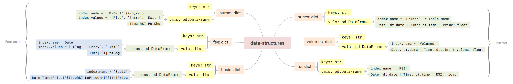
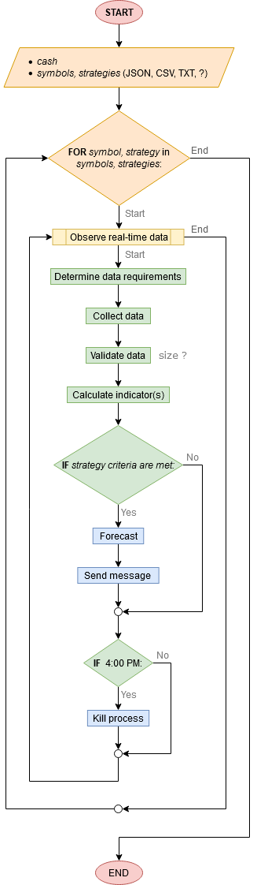
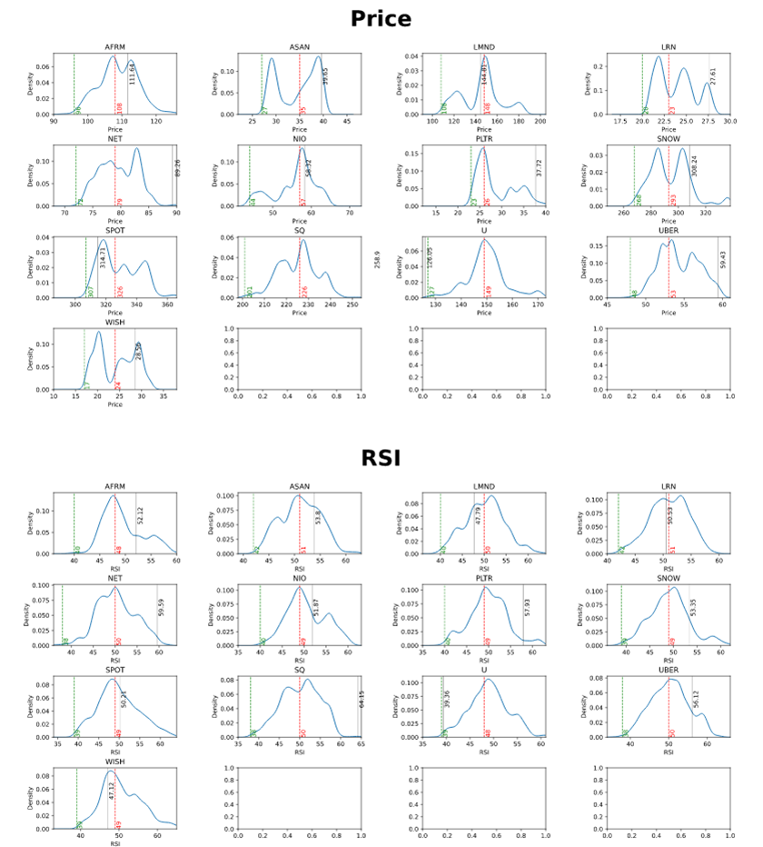

# python-stocks

Library for analyzing stocks

## Table of Contents

- [Packages](#packages)
- [Setup](#setup)
- [Examples](#examples)
- [License](#license)

## Packages



### collector

Actively observes stocks and sends alerts when a condition is met.

### daemon

Collects stock data from a source.

### dparser

Transforms collected data.

### forecaster

Generates forecast from collected data.

### indicators

Calculates indicators from collected data.

### alerts

Sends alerts.

### plotter

Plots collected data.

### utils

General utilities.

### xport

Imports and exports collected data.

## Setup

```bash
git clone https://github.com/hankadler/py-stocks stocks
cd stocks
mkdir .venv
pipenv --python 3.9
pinenv shell
pipenv install
```

## Examples

> This project was designed for personal use and not for mass distribution,
> hence the lack of docs and examples. I'm keeping it here as reference.





## License

[MIT](LICENSE)
